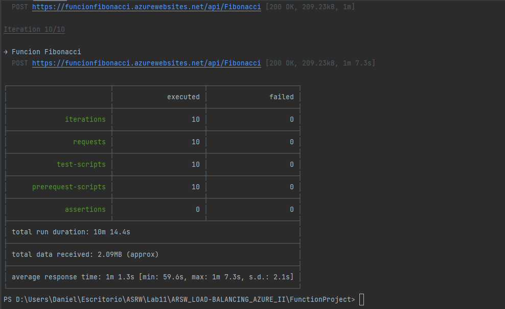
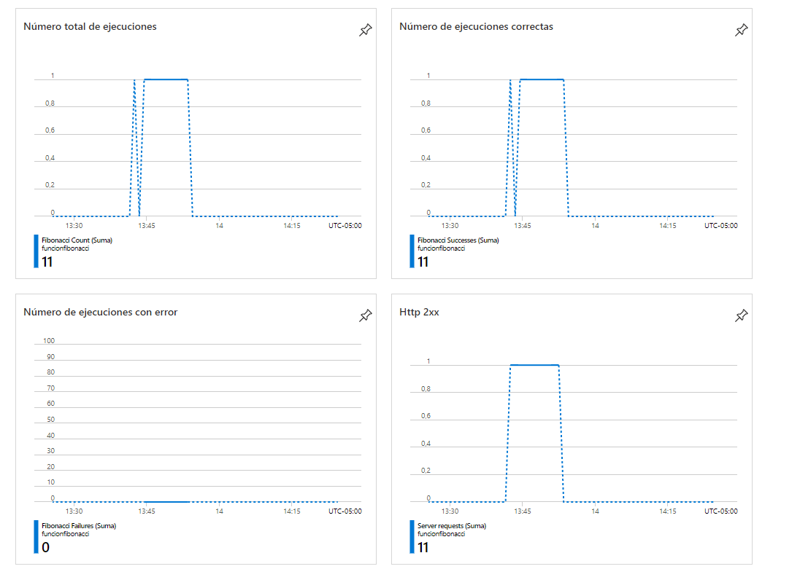
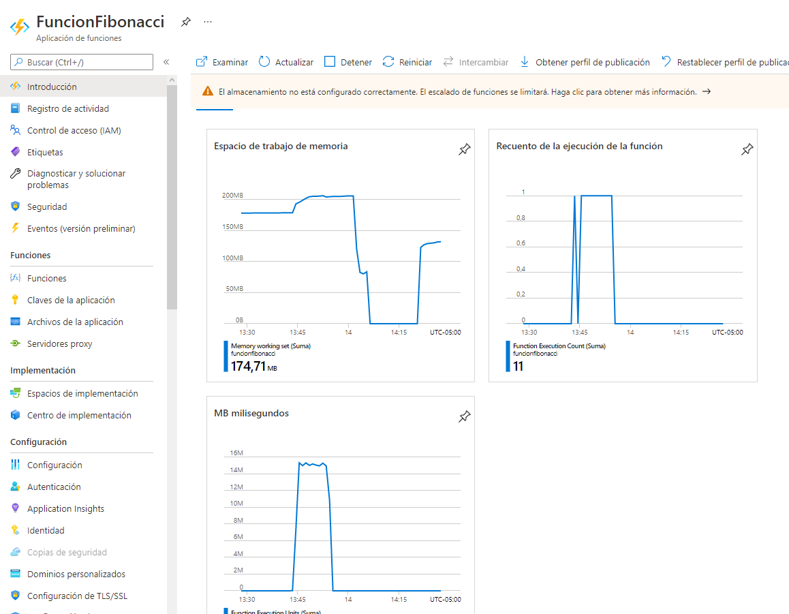
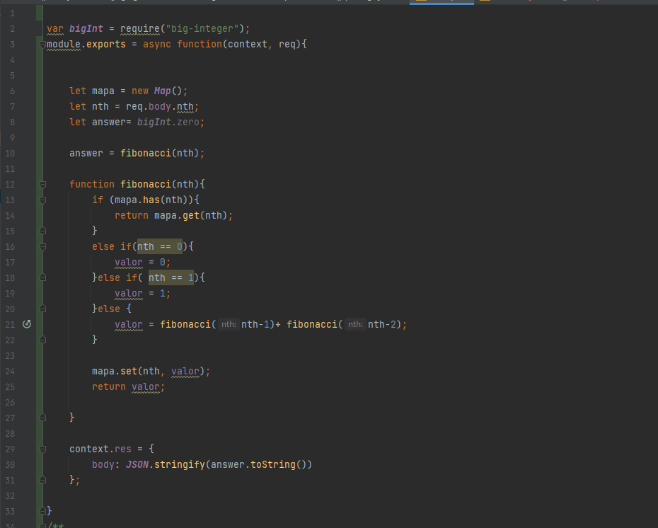
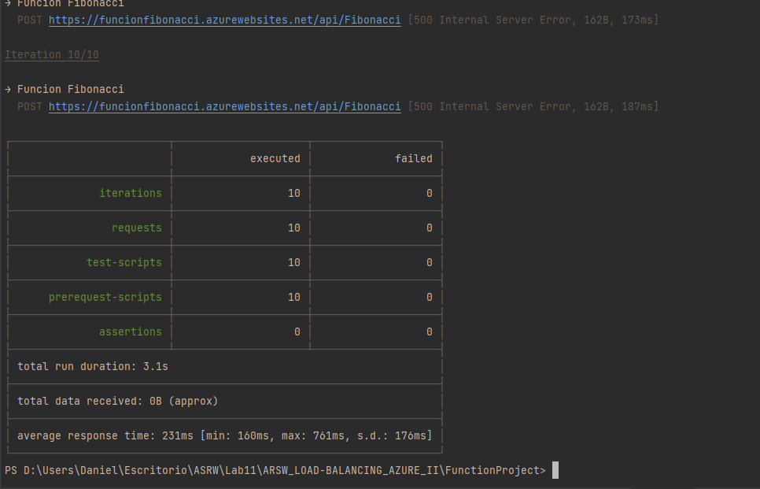
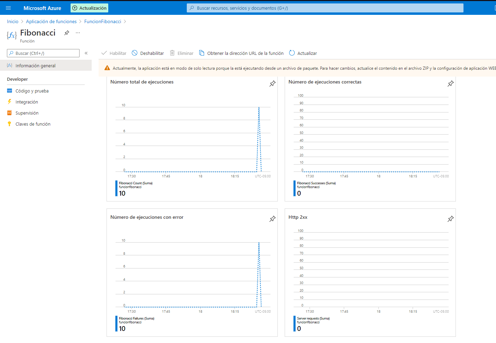
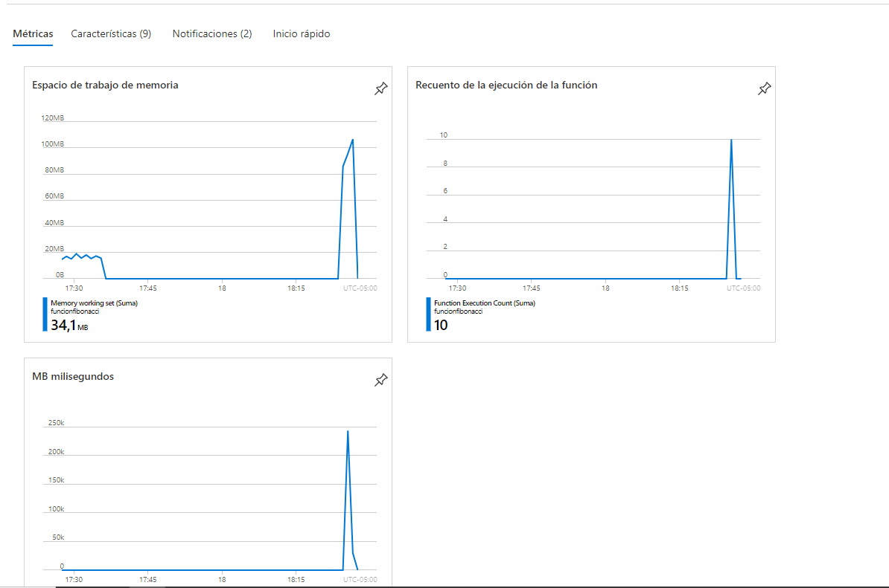
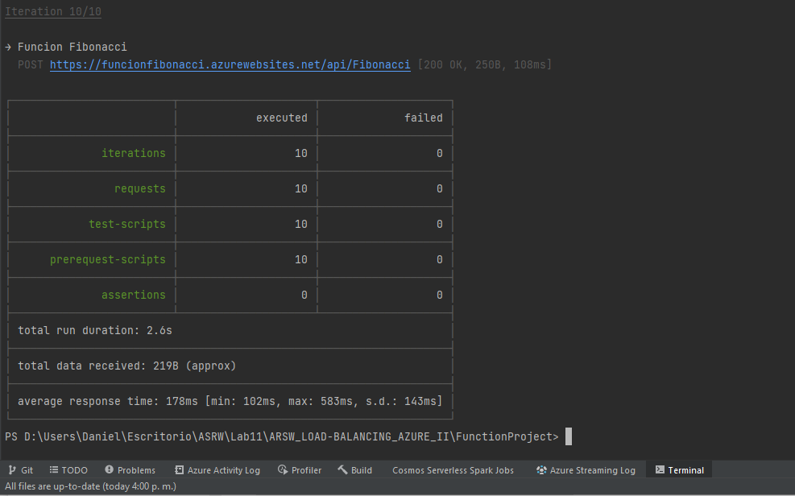
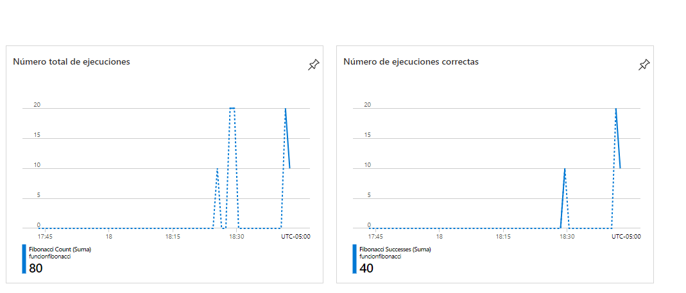
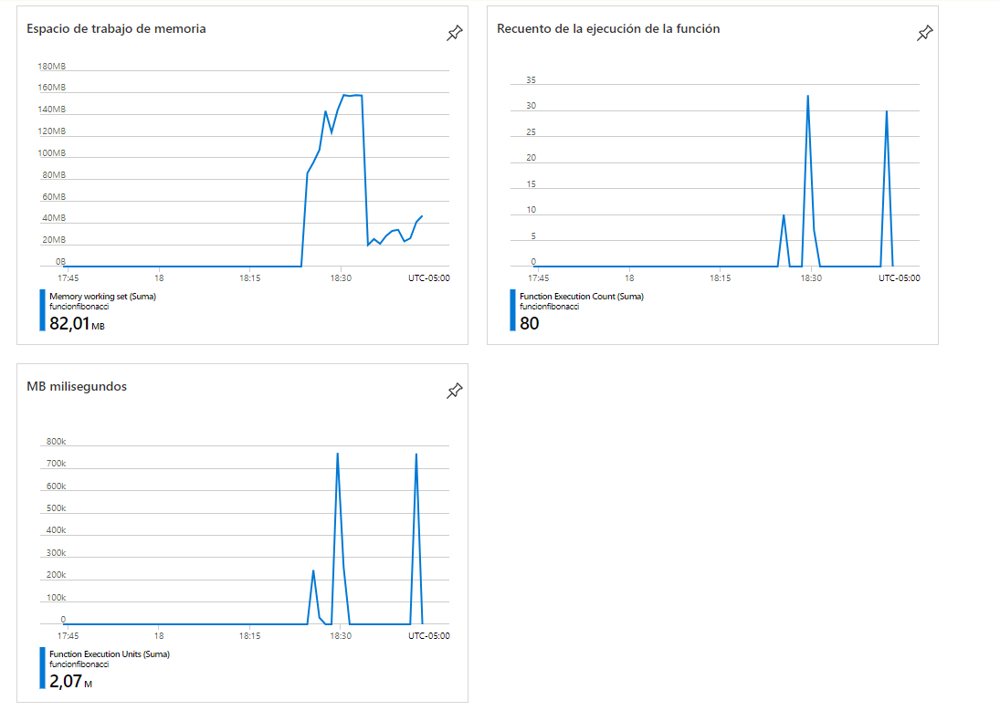

### Escuela Colombiana de Ingeniería
### Arquitecturas de Software - ARSW

## Escalamiento en Azure con Maquinas Virtuales, Sacale Sets y Service Plans

### Dependencias
* Cree una cuenta gratuita dentro de Azure. Para hacerlo puede guiarse de esta [documentación](https://azure.microsoft.com/en-us/free/search/?&ef_id=Cj0KCQiA2ITuBRDkARIsAMK9Q7MuvuTqIfK15LWfaM7bLL_QsBbC5XhJJezUbcfx-qAnfPjH568chTMaAkAsEALw_wcB:G:s&OCID=AID2000068_SEM_alOkB9ZE&MarinID=alOkB9ZE_368060503322_%2Bazure_b_c__79187603991_kwd-23159435208&lnkd=Google_Azure_Brand&dclid=CjgKEAiA2ITuBRDchty8lqPlzS4SJAC3x4k1mAxU7XNhWdOSESfffUnMNjLWcAIuikQnj3C4U8xRG_D_BwE). Al hacerlo usted contará con $200 USD para gastar durante 1 mes.

### Parte 0 - Entendiendo el escenario de calidad

Adjunto a este laboratorio usted podrá encontrar una aplicación totalmente desarrollada que tiene como objetivo calcular el enésimo valor de la secuencia de Fibonnaci.

**Escalabilidad**
Cuando un conjunto de usuarios consulta un enésimo número (superior a 1000000) de la secuencia de Fibonacci de forma concurrente y el sistema se encuentra bajo condiciones normales de operación, todas las peticiones deben ser respondidas y el consumo de CPU del sistema no puede superar el 70%.

### Escalabilidad Serverless (Functions)

1. Cree una Function App tal cual como se muestra en las  imagenes.

2. Instale la extensión de **Azure Functions** para Visual Studio Code.

3. Despliegue la Function de Fibonacci a Azure usando Visual Studio Code. La primera vez que lo haga se le va a pedir autenticarse, siga las instrucciones.

4. Dirijase al portal de Azure y pruebe la function.

5. Modifique la coleción de POSTMAN con NEWMAN de tal forma que pueda enviar 10 peticiones concurrentes. Verifique los resultados y presente un informe.

Se realizaron las 10 peticiones de forma recurrente y logramos observar el consumo de memoria que presento la funcion
de aproximadamente 200MB al realizar fibonacci de 1000000

6. Cree una nueva Function que resuleva el problema de Fibonacci pero esta vez utilice un enfoque recursivo con memoization. Pruebe la función varias veces, después no haga nada por al menos 5 minutos. Pruebe la función de nuevo con los valores anteriores. ¿Cuál es el comportamiento?.

Codigo fibonacci recurrente con memorizacion;

primeras 10 veses

No se ejecuto ninguna peticion de forma correta debido a que el numero es demaciado grande con fibonacci 1000000

Podemos ver que el consumo y el tiempo que le tomo a la funcion en realizar la peticiones son bastante notorios ya que
le toma menos memoria y menos tiempo en responder la peticiones.

Pasados 5 minutos

Podemos ver que el tiempo que toma en responder las peticiones es el mismo pero el consumo de memoria es menor a las primeras 20 peticiones
realizadas anteriormente

**Preguntas**

* ¿Qué es un Azure Function?

Azure Functions es un servicio en la nube disponible bajo demanda que proporciona toda la infraestructura y los recursos continuamente 
actualizados necesarios para ejecutar sus aplicaciones. Usted se concentra en los fragmentos de código que más le importan y Functions 
se encarga del resto. Functions proporciona procesamiento sin servidor para Azure.

* ¿Qué es serverless?

es un modelo de ejecución en el que el proveedor en la nube (AWS, Azure o Google Cloud) es responsable de ejecutar 
un fragmento de código mediante la asignación dinámica de los recursos. Y cobrando solo por la cantidad de recursos 
utilizados para ejecutar el código. El código, generalmente, se ejecuta dentro de contenedores sin estado que pueden 
ser activados por una variedad de eventos que incluyen solicitudes HTTP, eventos de base de datos, servicios de colas, 
alertas de monitoreo, carga de archivos, eventos programados (trabajos cron), etc. El código que se envía a al proveedor 
en la nube para la ejecución es generalmente en forma de una función.

* ¿Qué es el runtime y que implica seleccionarlo al momento de crear el Function App?

para implementar funciones integradas en un lenguaje de programación, durante el tiempo de ejecución (ejecución)de un programa de computadora.
Esto a menudo incluye funciones de entrada y salida, o para la gestión de la memoria.

* ¿Por qué es necesario crear un Storage Account de la mano de un Function App?

contiene todos los objetos de datos de Azure Storage: blobs, recursos compartidos de archivos, colas, tablas y discos. 
La cuenta de almacenamiento proporciona un espacio de nombres único para los datos de Azure Storage que es accesible desde cualquier 
lugar del mundo mediante HTTP o HTTPS.

* ¿Cuáles son los tipos de planes para un Function App?, ¿En qué se diferencias?, mencione ventajas y desventajas de cada uno de ellos.

consumo(sin servicio)
Functions premium
plan de app service

* ¿Por qué la memoization falla o no funciona de forma correcta?

Debido que el tiempo que le toma en realizar la peticion es el mismo siempre y esta esta realizando consumo de memoria apesar que se esta
realizando la memorizacion del numero de fibonacci.

* ¿Cómo funciona el sistema de facturación de las Function App?

El modo de facturacion se realiza por el numero de peticiones que resiva el sitio y por el consumo de memoria que este genere

* Informe
